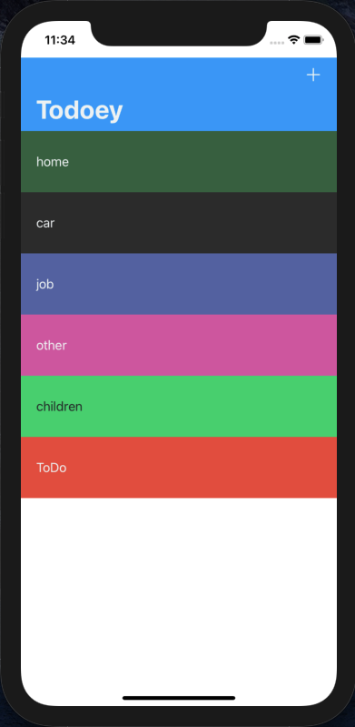
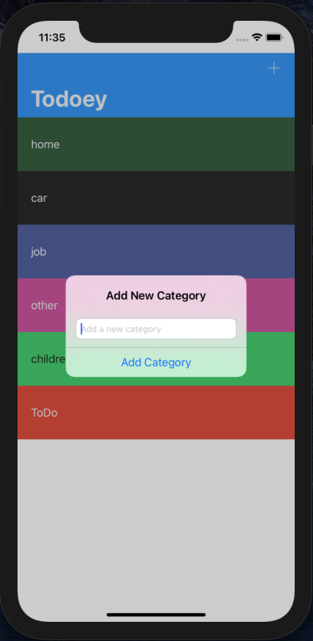
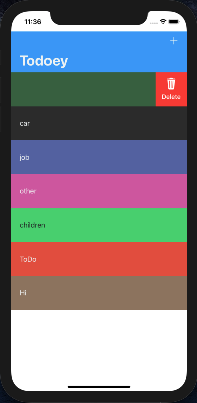
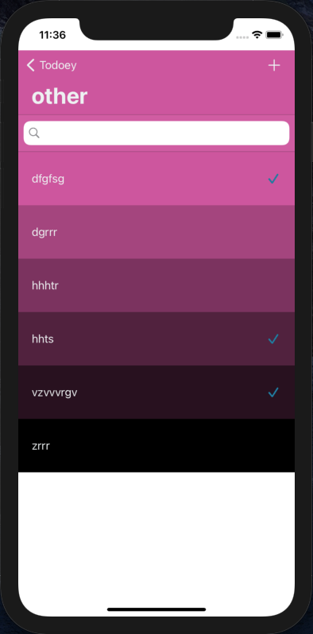
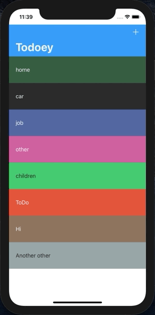

# ToDoList
___
## Оглавление
- **[Описание](#Description)**
- **[Презентация](#Presentation)**

## Описание
Приложение планировщик. Учебный проект.
В ходе разработки сохранение данных прошло эволюционное развитие от **UserDefaults** через **CoreData** до **Realm**. Текущая версия на **Realm**

- Проект написан на **UIKit**
- Использована стандартная архитектура **MVC**
- Верстка интерфейса **Кодом + Storyboard**
- Хранение данных **Realm**
- Дополнительные поды **ChameleonFramework** **SwipeCellKit**

___

## Презентация
### Основной экран

### Экран запланированных дел

### Работа приложения

___

